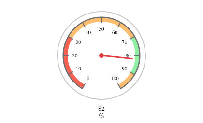

# Plant Sensor
In the past, I would always forget to water my plants. Therefore, I decided to create a low cost and lightweight sensor
such that I can monitor the well-being of my plants and act accordingly. The sensor measures the soil moisture level of
each plant, as well as the temperature and relative humidity of the air. This data is pushed to Thingspeak, which can be
used for further processing.

**The Hardware**  
The firmware targets an *ESP8266* microcontroller. A *capacitive moisture sensor* and a *DHT11* are used to perform the soil
and air measurements respectively. Currently, the module is powered using a phone charger, but plans are made to change
this to a battery in the future. In order to preserve power in this case, the ESP8266 is programmed to enter
deep sleep after successfully pushing the sensor data. This operation mode turns off the WiFi module, the system clock,
and the CPU, while only keeping the RTC operational. After a configured timeout, the board is woken up using a reset.
Additionally, the on board LED is removed to further reduce power consumption.


An example thingspeak channel for one of my plant sensors can be found [here](https://thingspeak.com/channels/1677314).



## Requirements
- PlatformIO Core CLI

## Installation
```asm
pio run --target upload

# Optionally monitor the serial output
pio run --target monitor
```

## Usage
Copy `src/credentials.h.example` to `src/credentials.h` and fill in your Thingspeak API key.

At first use, the sensor creates a WiFi access point and serves a simple webpage that allows the user to configure an
existing WiFi network for the sensor. These credentials are saved in EEPROM and can be used even after the sensor is 
reset.